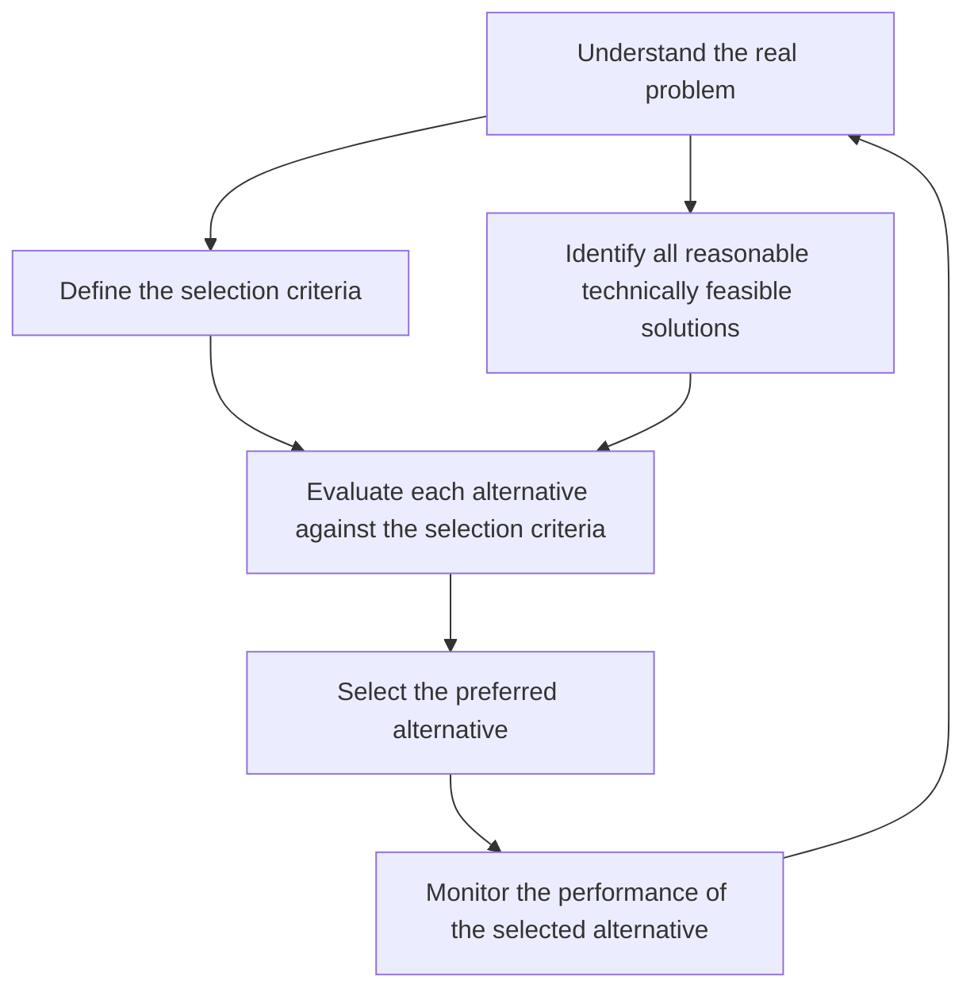

# Performance

## Decision-Making Process

Adapted from [Guide to the Software Engineering Body of Knowledge v4.0](https://ieeecs-media.computer.org/media/education/swebok/swebok-v4.pdf)

## Profile

Run the process for real to measure where the time is being spent and establish a baseline.

## It's Probably I/O

https://www.youtube.com/watch?v=si9iqF5uTFk&t=2397s

<iframe width="560" height="315" src="https://www.youtube-nocookie.com/embed/si9iqF5uTFk?si=NnliaXYtSjplucls&amp;start=2397" title="YouTube video player" frameborder="0" allow="accelerometer; autoplay; clipboard-write; encrypted-media; gyroscope; picture-in-picture; web-share" referrerpolicy="strict-origin-when-cross-origin" allowfullscreen> </iframe>
